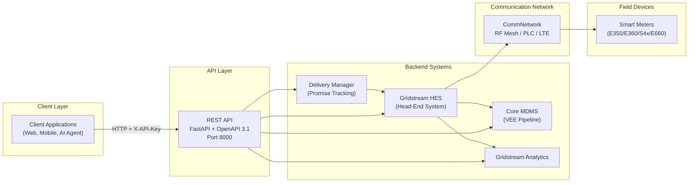
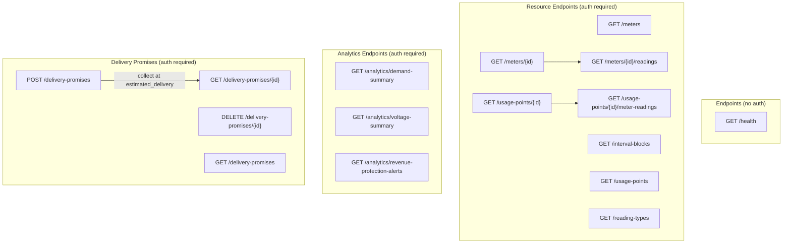
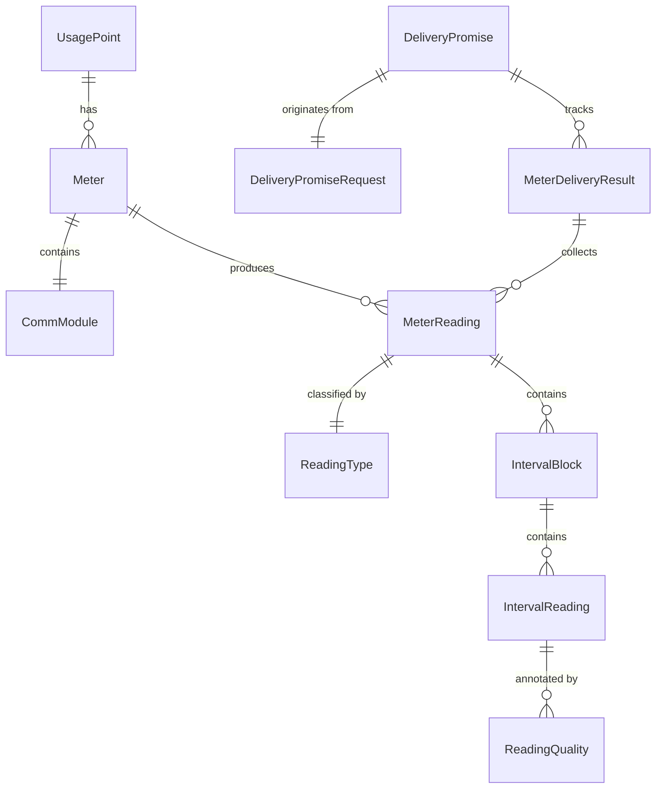
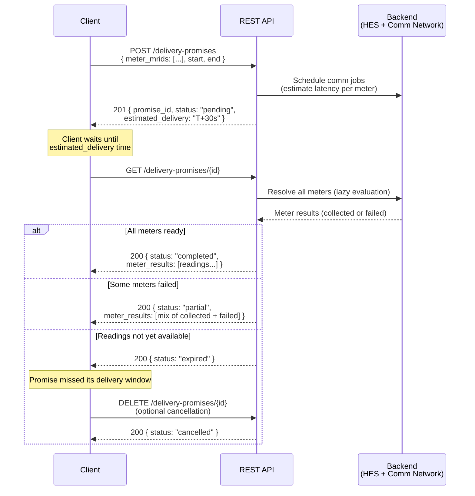
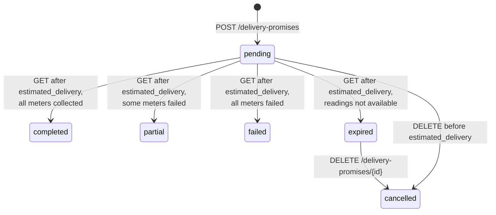
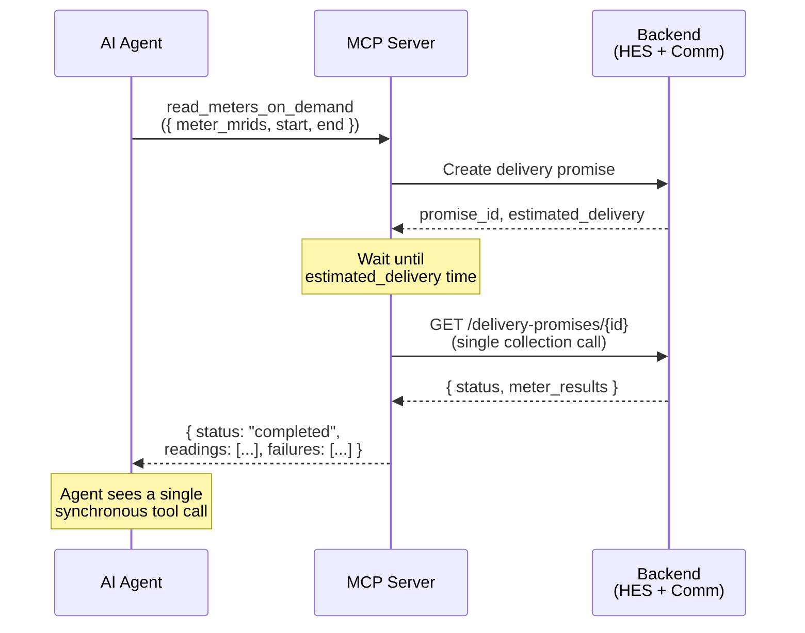

# OpenAPI Implementation Specification for AMI Head-End Systems

**Purpose:** A vendor-facing specification for layering a CIM-compatible REST API on top of an existing AMI backend (Head-End System, MDM, Analytics). This document assumes the backend systems already exist and focuses exclusively on the HTTP interface, authentication, data shapes, and — critically — the asynchronous delivery promise pattern that decouples AMI communication latency from the REST request/response cycle.

**Standards basis:** IEC 61968-9:2024 (CIM for meter data exchange), ANSI C84.1 (voltage ranges), IEC 62056 DLMS/COSEM (meter protocol concepts).

---

## 1. Design Principles

| Principle | Rationale |
|-----------|-----------|
| **Async-first for on-demand reads** | AMI communication networks (RF Mesh, PLC, Cellular) have 3–25 second latencies and non-trivial failure rates. The API must never block an HTTP connection waiting for a meter to respond. |
| **CIM-aligned data models** | Use IEC 61968-9 naming and structure (EndDevice, MeterReading, IntervalBlock, ReadingType, UsagePoint) so integrators can map directly to utility data standards. |
| **snake_case JSON** | Python/JS-friendly. CIM field names are adapted to snake_case (e.g., `mRID` → `mrid`, `flowDirection` → `flow_direction`). |
| **Paginated collections** | Every list endpoint returns `{ total, limit, offset, items[] }`. Default page size 20, max 100. |
| **Stateless auth** | API key in `X-API-Key` header. No sessions, no cookies. Health endpoint is unauthenticated. |
| **UTC everywhere** | All datetime fields are ISO 8601 with UTC timezone offset. |

---

## 2. System Architecture



---

## 3. Authentication

All endpoints except `GET /health` require a static API key.

| Header | Value |
|--------|-------|
| `X-API-Key` | Pre-shared secret configured in the backend |

**Error responses:**

| Condition | Status | Body |
|-----------|--------|------|
| Header missing | `401` | `{"detail": "Missing API key. Provide X-API-Key header."}` |
| Key invalid | `401` | `{"detail": "Invalid API key."}` |

> **Vendor note:** Replace with OAuth 2.0 / mutual TLS in production. The API key pattern is sufficient for internal integrations and test environments.

---

## 4. Endpoint Summary

All paths are prefixed with a version segment (e.g., `/api/v1`).



| Method | Path | Auth | Description |
|--------|------|------|-------------|
| GET | `/health` | No | Liveness check |
| GET | `/meters` | Yes | List meters (filterable) |
| GET | `/meters/{id}` | Yes | Single meter detail |
| GET | `/meters/{id}/readings` | Yes | Historical readings for a meter |
| GET | `/interval-blocks` | Yes | Cross-meter interval block query |
| GET | `/usage-points` | Yes | List usage points |
| GET | `/usage-points/{id}` | Yes | Single usage point detail |
| GET | `/usage-points/{id}/meter-readings` | Yes | Readings via usage point |
| GET | `/reading-types` | Yes | Catalog of reading type definitions |
| GET | `/analytics/demand-summary` | Yes | Demand analytics |
| GET | `/analytics/voltage-summary` | Yes | Voltage analytics |
| GET | `/analytics/revenue-protection-alerts` | Yes | Tamper / anomaly alerts |
| **POST** | **`/delivery-promises`** | **Yes** | **Create async on-demand read request** |
| **GET** | **`/delivery-promises/{id}`** | **Yes** | **Collect results at promised delivery time** |
| **DELETE** | **`/delivery-promises/{id}`** | **Yes** | **Cancel an expired or unneeded promise (optional)** |
| GET | `/delivery-promises` | Yes | List all promises |

---

## 5. Core Data Models

Implement these as your response schemas. Field names are snake_case; types map to JSON primitives.

### 5.1 Entity Relationships



### 5.2 Meter (EndDevice)

```
mrid                   string   UUID, primary key
serial_number          string   Manufacturer serial
manufacturer           string   e.g. "Landis+Gyr"
model                  string   e.g. "E350", "S4x/E650"
firmware_version       string
status                 enum     active | commFailure | maintenance | inactive
connection_state       enum     connected | physicallyDisconnected | logicallyDisconnected
install_date           datetime UTC
phase_code             enum     AN | ABCN | none | ...  (IEC phase codes)
meter_type             enum     Vendor-specific model family
rated_power_w          float    Nameplate rating in watts
ct_ratio               float    Current transformer ratio (1.0 for residential)
form_number            string   ANSI meter form (2S, 9S, 16S, etc.)
demand_interval_minutes int     Typically 15
usage_point_mrid       string   FK to UsagePoint
comm_module            object   Nested CommModule (see below)
```

**CommModule** (nested in Meter):

```
comm_type              enum     RF Mesh | PLC | Cellular LTE
firmware_version       string
mac_address            string
signal_strength        float    dBm
last_communication     datetime UTC
```

### 5.3 ReadingType

CIM ReadingType defines *what* is being measured. Your backend likely has a fixed catalog.

```
mrid                     string  UUID
name                     string  Human-readable (e.g. "Forward Active Energy (Wh)")
accumulation             enum    deltaData | instantaneous | bulkQuantity | ...
flow_direction           enum    forward | reverse | net | none
commodity                enum    electricitySecondaryMetered | ...
measurement_kind         enum    energy | demand | voltage | current | ...
unit                     enum    Wh | W | V | A | VA | VAr | Hz | none
phase                    enum    Same as phase_code
measuring_period_minutes int     Interval length (typically 15)
multiplier               float   Scale factor (typically 1.0)
```

### 5.4 IntervalReading / IntervalBlock / MeterReading

This is the core reading hierarchy (IEC 61968-9 structure):

```
MeterReading
├── mrid                 string    UUID
├── meter_mrid           string    FK to Meter
├── usage_point_mrid     string    FK to UsagePoint
├── reading_type_mrid    string    FK to ReadingType
├── time_period          object    { start: datetime, end: datetime }
├── is_validated         boolean   True if VEE-processed
└── interval_blocks[]
    └── IntervalBlock
        ├── mrid                 string
        ├── reading_type_mrid    string
        ├── time_period          object   { start, end }
        └── interval_readings[]
            └── IntervalReading
                ├── timestamp    datetime  UTC
                ├── value        float     Reading value
                └── quality[]
                    └── ReadingQuality
                        ├── quality_type  enum  valid|estimated|suspect|missing|manuallyEdited
                        ├── comment       string|null
                        └── source        string  e.g. "HES", "VEE"
```

### 5.5 UsagePoint

```
mrid                     string
name                     string
connection_state         enum
phase_code               enum
rated_power_w            float
rated_voltage_v          float
service_category         string    residential | commercial | industrial
meter_mrids              string[]  Associated meter UUIDs
service_location_address string
customer_account_id      string
```

### 5.6 Analytics Models

**DemandSummary:**
```
meter_mrid               string|null   null = fleet-wide
time_period              object        { start, end }
peak_demand_w            float
peak_demand_timestamp    datetime
average_demand_w         float
min_demand_w             float
load_factor              float         0.0–1.0
data_points[]            array         [{ timestamp, demand_w }]
```

**VoltageSummary:**
```
meter_mrid               string|null
time_period              object
average_voltage_v        float
max_voltage_v            float
min_voltage_v            float
std_dev_voltage_v        float
ansi_c84_1_exceedance_count  int       Intervals outside ±5% nominal
data_points[]            array         [{ timestamp, voltage_v }]
```

**RevenueProtectionAlert:**
```
mrid                     string
meter_mrid               string
alert_type               enum    tamper | bypass | reverse_flow | consumption_anomaly
severity                 enum    low | medium | high | critical
detected_at              datetime
description              string
time_period              object  { start, end }
```

---

## 6. The Delivery Promise Pattern (Critical Path)

This is the most important part of the API. It solves a fundamental problem: **AMI communication networks are slow and unreliable**, but REST clients expect fast responses. The delivery promise is **not a polling mechanism** — the API tells the client exactly when to come back, and the client makes a single return trip to collect results.

### 6.1 The Problem

On-demand meter reads traverse a communication network with:

| Comm Type | Latency | Failure Rate |
|-----------|---------|--------------|
| Cellular LTE | 3–8 s | ~5% |
| RF Mesh | 8–20 s | ~10% |
| PLC | 12–25 s | ~15% |
| COMM_FAILURE meters | — | ~80% |

A single-meter read could take 25 seconds. A batch of 50 meters could take 30+ seconds. HTTP connections should not block for that long. But continuous polling wastes bandwidth and complicates client logic. The solution is a **time-of-delivery promise**: the API calculates when data will be ready and tells the client when to return.

### 6.2 The Solution: Delivery Promises

The pattern has exactly two interactions:

1. **POST** — Client requests an on-demand read. The API returns a promise with an `estimated_delivery` timestamp.
2. **GET** (at the promised time) — Client returns at or after `estimated_delivery` to collect results. If readings are available, the promise resolves. If not, the promise is marked `expired` and the client may optionally send a `DELETE` to cancel.

There is **no polling loop**. The client trusts the promised delivery time.



> **Key insight:** The `estimated_delivery` timestamp is a **contract**. The backend commits to having data ready by that time. The client commits to not asking before that time. If the backend cannot fulfill the promise, it expires — the client does not retry or poll.

### 6.3 DeliveryPromise Model

**Request (POST body):**
```
meter_mrids          string[]       Required, non-empty. Meters to read.
start                datetime       Required. Reading window start.
end                  datetime       Required. Reading window end. Must be > start.
reading_type_mrid    string|null    Optional. Restrict to one reading type.
validated_only       boolean        Optional (default false). Apply VEE before returning.
```

**Response (DeliveryPromise):**
```
promise_id           string         UUID assigned by the API.
status               enum           pending | completed | partial | failed | expired | cancelled
created_at           datetime       When the promise was created.
estimated_delivery   datetime       When to collect results. This is the promised time.
expires_at           datetime       Promise expiration (estimated_delivery + grace window).
request              object         Echo of the original request.
meters_total         int            Count of requested meters.
meters_collected     int            Count successfully collected so far.
meters_failed        int            Count that have failed.
meter_results[]      array          Per-meter status (see below).
failure_summary      string|null    Human-readable failure description.
```

**MeterDeliveryResult (per-meter within the promise):**
```
meter_mrid           string         Which meter this result is for.
status               enum           pending | collected | failed
readings             MeterReading[]|null   Populated when status = collected.
failure_reason       string|null    Populated when status = failed.
```

### 6.4 Promise Status Lifecycle



- **pending:** Promise created. Backend is collecting data. Client should wait until `estimated_delivery`.
- **completed:** Client collected at or after `estimated_delivery`. All meters returned readings.
- **partial:** Client collected at or after `estimated_delivery`. Some meters succeeded, some failed. Partial data available.
- **failed:** Client collected at or after `estimated_delivery`. All meters failed. No data.
- **expired:** Client collected at or after `estimated_delivery` but readings were not yet available (backend missed its promise). No retry — the promise is dead.
- **cancelled:** Client explicitly cancelled the promise via `DELETE`. This is optional cleanup.

### 6.5 Implementation Guidance for Vendors

**Estimated delivery calculation:**
```
estimated_delivery = created_at + max(per_meter_latency) + buffer
expires_at          = estimated_delivery + grace_window
```
Where `per_meter_latency` is determined by each meter's communication type, `buffer` accounts for network variability (5 seconds is typical), and `grace_window` is a short period after the promised time during which the backend will still accept a collection request (e.g., 30 seconds). After `expires_at`, the promise is automatically expired.

**Resolution on GET (single collection):**
When the client sends `GET /delivery-promises/{id}`, the backend resolves all meters in a single pass. For each meter: if `now >= collection_time`, the meter transitions to `collected` (readings populated) or `failed` (failure_reason populated). If any meters are still pending after this resolution pass and `now >= estimated_delivery`, the promise transitions to `expired` — the backend missed its commitment. This is a **lazy evaluation** — no background threads or webhooks required.

**Client contract:** The client makes at most **one** GET request per promise, at or after `estimated_delivery`. The API does not expect or support repeated polling. If the client needs to retry, it creates a **new** promise.

**Optional cancellation:** The client may send `DELETE /delivery-promises/{id}` to explicitly cancel a promise that has expired or is no longer needed. This is housekeeping — the backend may garbage-collect expired promises automatically.

**Backend integration pseudocode:**

```
POST /delivery-promises:
  1. For each meter_mrid in request:
     a. Look up the meter's comm pathway
     b. Estimate latency based on comm type
     c. Determine success/failure based on comm type failure rate + meter status
     d. Record { collection_time, will_succeed, failure_reason } per meter
  2. Compute estimated_delivery from slowest meter + buffer
  3. Compute expires_at from estimated_delivery + grace_window
  4. Store promise (status = pending) and return 201

GET /delivery-promises/{id}:
  1. If status is not "pending", return as-is (already resolved)
  2. If now < estimated_delivery, return as-is (client is early, still pending)
  3. If now > expires_at, set status = "expired" and return
  4. Resolve all meters in a single pass:
     a. For each meter: if now >= collection_time and will_succeed → collected
     b. For each meter: if now >= collection_time and will_fail → failed
     c. If any meters still pending → status = "expired" (backend missed promise)
     d. If all collected → "completed"
     e. If mix of collected + failed → "partial"
     f. If all failed → "failed"
  5. Return resolved promise

DELETE /delivery-promises/{id}:
  1. Set status = "cancelled"
  2. Return 200
```

**Readings source:** When a meter is "collected," the backend produces readings for the requested time window. This can come from a live meter read (real AMI), cached recent data, or a simulation engine. The API layer doesn't care — it just calls whatever the backend provides.

---

## 7. Endpoint Implementation Details

### 7.1 GET /health (no auth)

Return `{ "status": "healthy", "meter_count": N, "version": "1.0.0" }`.

### 7.2 GET /meters

**Query filters** (all optional):
- `meter_type` — enum filter
- `status` — enum filter (alias for `meter_status`)
- `comm_type` — enum filter
- `limit` (1–100, default 20), `offset` (>=0, default 0)

Apply filters to the backend meter inventory, paginate, return `PaginatedResponse[Meter]`.

### 7.3 GET /meters/{id}

Lookup by mRID. Return `Meter` or `404`.

### 7.4 GET /meters/{id}/readings

**Query parameters:**
- `start`, `end` — datetime range filter (optional)
- `reading_type_mrid` — filter to specific measurement (optional)
- `validated_only` — boolean, if true return VEE-processed readings (optional, default false)
- `limit`, `offset` — pagination

Source: pre-collected historical data from HES (raw) or MDM (validated).

### 7.5 GET /interval-blocks

Cross-meter query. Accepts `meter_mrids` (comma-separated string), `reading_type_mrid`, `start`, `end`. Returns a flat list of IntervalBlocks across multiple meters. If `meter_mrids` is omitted, queries all meters.

### 7.6 GET /usage-points, GET /usage-points/{id}

Standard CRUD reads on usage points. Filter by `connection_state`. The `/{id}/meter-readings` sub-resource aggregates readings across all meters associated with the usage point. Accepts `start`, `end`, `limit`, `offset`.

### 7.7 GET /reading-types

Return the full catalog. No filtering needed — this is typically a small, fixed set (4–10 types). Wrap in `PaginatedResponse` for consistency.

### 7.8 Analytics endpoints

All accept optional `start`, `end` (default to last 7 days), optional `meter_mrid`. Delegate to the analytics backend. Return arrays (not paginated) since result sets are small.

### 7.9 Delivery Promises

See Section 6 above. This is the critical path. Three operations:

- **POST /delivery-promises** — Create a promise. Returns `201` with `estimated_delivery` timestamp.
- **GET /delivery-promises/{id}** — Collect results at or after `estimated_delivery`. Single call, not a poll. Returns `completed`, `partial`, `failed`, or `expired`.
- **DELETE /delivery-promises/{id}** — Optional. Cancel an expired or unneeded promise. Returns `200` with `status: "cancelled"`.

---

## 8. Error Responses

Use standard HTTP status codes with a JSON detail field:

| Status | Usage |
|--------|-------|
| `200` | Success |
| `201` | Promise created |
| `401` | Missing or invalid API key |
| `404` | Resource not found |
| `422` | Validation error (empty meter list, start >= end, etc.) |

Body: `{ "detail": "Human-readable message" }`

---

## 9. Pagination Convention

Every list endpoint uses the same shape:

```json
{
  "total": 142,
  "limit": 20,
  "offset": 0,
  "items": [ ... ]
}
```

Query parameters: `limit` (1–100, default 20), `offset` (>=0, default 0).

---

## 10. Alternative: MCP (Model Context Protocol) Interface

For AI-agent and LLM-tool integration, the same backend can be exposed as an **MCP server** instead of (or alongside) the REST API. MCP is Anthropic's open protocol for connecting AI models to external tools and data sources.

### 10.1 Why MCP?

The delivery promise pattern maps naturally to MCP's tool-calling model:

- **REST approach:** The client must create a promise, note the `estimated_delivery` time, wait, then make a second HTTP call to collect. The client also handles expiration and optional cancellation. This two-step flow is straightforward but requires the client to manage timing.
- **MCP advantage:** The MCP server encapsulates the entire lifecycle — create, wait, collect — inside a single tool call. The AI agent calls `read_meters_on_demand(meter_mrids=[...])` and the MCP server handles the timing internally, returning the final readings when ready.



### 10.2 Recommended MCP Tools

| Tool Name | Description | Maps to REST |
|-----------|-------------|--------------|
| `list_meters` | List/filter the meter fleet | `GET /meters` |
| `get_meter` | Get single meter detail | `GET /meters/{id}` |
| `get_meter_readings` | Historical readings for a meter | `GET /meters/{id}/readings` |
| `read_meters_on_demand` | **Synchronous on-demand read** — creates a delivery promise, waits for estimated delivery time, collects results | `POST + GET /delivery-promises` |
| `list_usage_points` | List service locations | `GET /usage-points` |
| `get_demand_summary` | Demand analytics for a period | `GET /analytics/demand-summary` |
| `get_voltage_summary` | Voltage analytics for a period | `GET /analytics/voltage-summary` |
| `get_revenue_alerts` | Revenue protection alerts | `GET /analytics/revenue-protection-alerts` |
| `list_reading_types` | Catalog of measurement types | `GET /reading-types` |

### 10.3 The Key Tool: `read_meters_on_demand`

This is where MCP shines. The tool signature:

```
read_meters_on_demand(
    meter_mrids: list[str],        # Meters to read
    start: str,                    # ISO 8601 datetime
    end: str,                      # ISO 8601 datetime
    reading_type_mrid: str | None, # Optional filter
    validated_only: bool = False   # Apply VEE?
) -> {
    status: str,                   # completed | partial | failed
    meters_collected: int,
    meters_failed: int,
    readings: list[MeterReading],  # All collected readings
    failures: list[{meter_mrid, reason}]  # Any failures
}
```

**Internal implementation:**
1. Call the backend's delivery promise creation (same logic as `POST /delivery-promises`)
2. Wait until `estimated_delivery` time (sleep for the promised duration)
3. Make a single collection call (`GET /delivery-promises/{id}`)
4. Aggregate all collected readings and failures into a single response
5. Return to the AI agent

The agent never sees the promise lifecycle — it just gets readings or failure reasons.

### 10.4 MCP Server Implementation Sketch

```python
from mcp.server import Server
from mcp.types import Tool

server = Server("ami-headend")

@server.tool()
async def read_meters_on_demand(
    meter_mrids: list[str],
    start: str,
    end: str,
    reading_type_mrid: str | None = None,
    validated_only: bool = False,
) -> dict:
    """Read meters on-demand. Handles AMI communication latency internally."""
    # 1. Create the delivery promise via your backend
    promise = backend.create_delivery_promise(
        meter_mrids=meter_mrids,
        start=parse_datetime(start),
        end=parse_datetime(end),
        reading_type_mrid=reading_type_mrid,
        validated_only=validated_only,
    )

    # 2. Wait until the promised delivery time
    wait_seconds = (promise.estimated_delivery - datetime.now(UTC)).total_seconds()
    if wait_seconds > 0:
        await asyncio.sleep(wait_seconds)

    # 3. Single collection call
    promise = backend.get_delivery_promise(promise.promise_id)

    # 4. Aggregate results
    readings = []
    failures = []
    for result in promise.meter_results:
        if result.status == "collected" and result.readings:
            readings.extend(result.readings)
        elif result.status == "failed":
            failures.append({
                "meter_mrid": result.meter_mrid,
                "reason": result.failure_reason,
            })

    return {
        "status": promise.status,
        "meters_collected": promise.meters_collected,
        "meters_failed": promise.meters_failed,
        "readings": [r.model_dump() for r in readings],
        "failures": failures,
    }
```

### 10.5 The Downside: Agent–Server Coupling

The convenience of MCP comes at a cost. When the MCP server calls `read_meters_on_demand`, the agent's execution thread is **blocked for the entire duration of the delivery promise** — typically 8–30 seconds, potentially longer for large batches over RF Mesh or PLC. During this time, the agent is synchronized to the state of the MCP server, which is itself synchronized to the state of the AMI communication network. This creates a tight coupling chain:

```
Agent ←(blocked)→ MCP Server ←(waiting)→ Backend ←(collecting)→ Comm Network ←(transmitting)→ Meters
```

Every link in this chain must remain alive and responsive for the tool call to succeed. If any component stalls, the agent stalls with it.

#### 10.5.1 Time-Bounded Response Problem

AI agents typically operate under strict time budgets. An LLM tool call that blocks for 25 seconds consumes a significant fraction of the agent's turn — time that could be spent reasoning, calling other tools, or responding to the user. The consequences compound:

| Constraint | Impact of blocking MCP tool call |
|------------|----------------------------------|
| **Agent turn timeout** | Many agent frameworks enforce a per-turn time limit (e.g., 60–120 seconds). A single `read_meters_on_demand` for 10 PLC meters could consume half the budget, leaving no room for retries or follow-up queries. |
| **User-perceived latency** | The user sees the agent "thinking" with no intermediate output. Unlike REST — where the client receives the `estimated_delivery` time immediately and can display a countdown — the MCP agent appears frozen. |
| **Cascading failures** | If the MCP server's connection to the backend drops mid-wait, the agent receives a tool error after the full timeout. The agent has no way to distinguish "still waiting" from "something broke" until the call returns or times out. |
| **No concurrent work** | While blocked on one `read_meters_on_demand` call, the agent cannot issue parallel tool calls to other MCP servers, retrieve context, or perform intermediate reasoning. The agent's entire capability is serialized behind AMI latency. |
| **Retry amplification** | If the tool call fails (expired promise, network timeout), the agent must re-invoke from scratch — another 8–30 second wait. Two retries on a PLC batch could exhaust a 120-second turn budget with no data returned. |

#### 10.5.2 REST Avoids This Coupling

The delivery promise pattern over REST was designed precisely to avoid this problem. The two-step flow — POST to create, wait independently, GET to collect — means the client is **never blocked**:

- The POST returns immediately (~100 ms) with a promise and an `estimated_delivery` timestamp.
- The client is free to do other work during the wait period.
- The GET at `estimated_delivery` also returns immediately — with data, or with an `expired` status.

Neither HTTP call blocks on AMI communication. The latency is absorbed by the gap between the two calls, not by either call itself. The client and server are **temporally decoupled**.

#### 10.5.3 Mitigation Strategies

If MCP is still the preferred interface despite the coupling, consider these mitigations:

1. **Timeout parameter.** Add a `timeout_seconds` parameter to `read_meters_on_demand`. If the estimated delivery exceeds the timeout, return immediately with `status: "timeout"` and the `promise_id` so the agent can retrieve results later via a separate `get_promise_result(promise_id)` tool — effectively falling back to the two-step REST pattern.

2. **Split into two tools.** Offer `create_on_demand_read` (non-blocking, returns promise_id + estimated_delivery) and `collect_on_demand_read(promise_id)` (non-blocking, returns current state). This gives agents the same temporal decoupling as REST while staying in the MCP tool paradigm. The trade-off is that the agent must now manage timing — exactly the complexity MCP was supposed to hide.

3. **Batch size limits.** Restrict `meter_mrids` to a small count (e.g., 5) for the synchronous tool. For larger batches, require the two-tool pattern. This bounds worst-case blocking time.

4. **Streaming progress.** Use MCP's streaming capabilities (if supported by the agent framework) to send intermediate progress updates — `"3 of 5 meters collected"` — so the agent can reason about partial results or decide to abort early.

> **Recommendation:** For production deployments where agents operate under time budgets, use the **two-tool split** (strategy 2). Reserve the single synchronous `read_meters_on_demand` for interactive demos and small ad-hoc queries where simplicity outweighs latency concerns.

### 10.6 When to Use REST vs. MCP

| Scenario | Recommended |
|----------|-------------|
| Dashboard / web UI | REST (needs pagination, filtering, progressive loading) |
| Automated reporting pipeline | REST (scheduled collection, batch processing) |
| AI agent — small ad-hoc queries | **MCP** (hides async complexity, natural tool-call pattern) |
| AI agent — time-bounded turns | **REST** or **MCP two-tool split** (avoids blocking on AMI latency) |
| Interactive data exploration | **MCP** (agent can chain queries based on results) |
| System-to-system integration | REST (standard, auditable, cacheable) |
| Both human and AI consumers | Both — MCP server wraps the REST API internally |

### 10.7 MCP Resources (Optional)

In addition to tools, expose frequently-accessed data as MCP **resources**:

- `ami://meters` — Full meter inventory (for agent context)
- `ami://reading-types` — Reading type catalog
- `ami://meters/{mrid}/status` — Live meter status

Resources are read-only data the agent can pull into its context window without making a tool call.

---

## 11. Implementation Checklist

For a vendor layering this API on an existing backend:

- [ ] **Auth middleware** — Validate `X-API-Key` on all non-health routes
- [ ] **Meter inventory endpoint** — Map your meter database to the Meter schema
- [ ] **Reading types catalog** — Define your fixed set of ReadingType objects
- [ ] **Historical readings** — Query your HES/MDM for stored interval data
- [ ] **Usage points** — Map your service location / CIS data
- [ ] **Delivery promise store** — In-memory dict or Redis for promise state
- [ ] **Comm network latency model** — Map your actual comm type latencies into the promise ETA calculation
- [ ] **Promise resolution logic** — Lazy evaluation on single GET at estimated_delivery, expiration handling, optional DELETE cancellation
- [ ] **Analytics aggregation** — Demand, voltage, revenue protection queries against your data warehouse
- [ ] **Pagination** — Consistent `{ total, limit, offset, items }` wrapper
- [ ] **OpenAPI spec generation** — Use your framework's built-in spec generation (FastAPI, Spring, etc.)
- [ ] **CORS** — Allow dashboard and client origins
- [ ] **MCP server** (optional) — Wrap REST endpoints as MCP tools for AI integration

---

## Companion Document

The machine-readable implementation specification — a self-contained document that an AI coding agent can consume to produce a working API layer — is maintained separately:

**[AMI OpenAPI Agent Implementation Spec](./AMI_OPENAPI_AGENT_SPEC.md)**

That document contains the complete project structure, all Pydantic models, all router signatures, the delivery promise backend logic, the backend interface contract, and verification steps.
